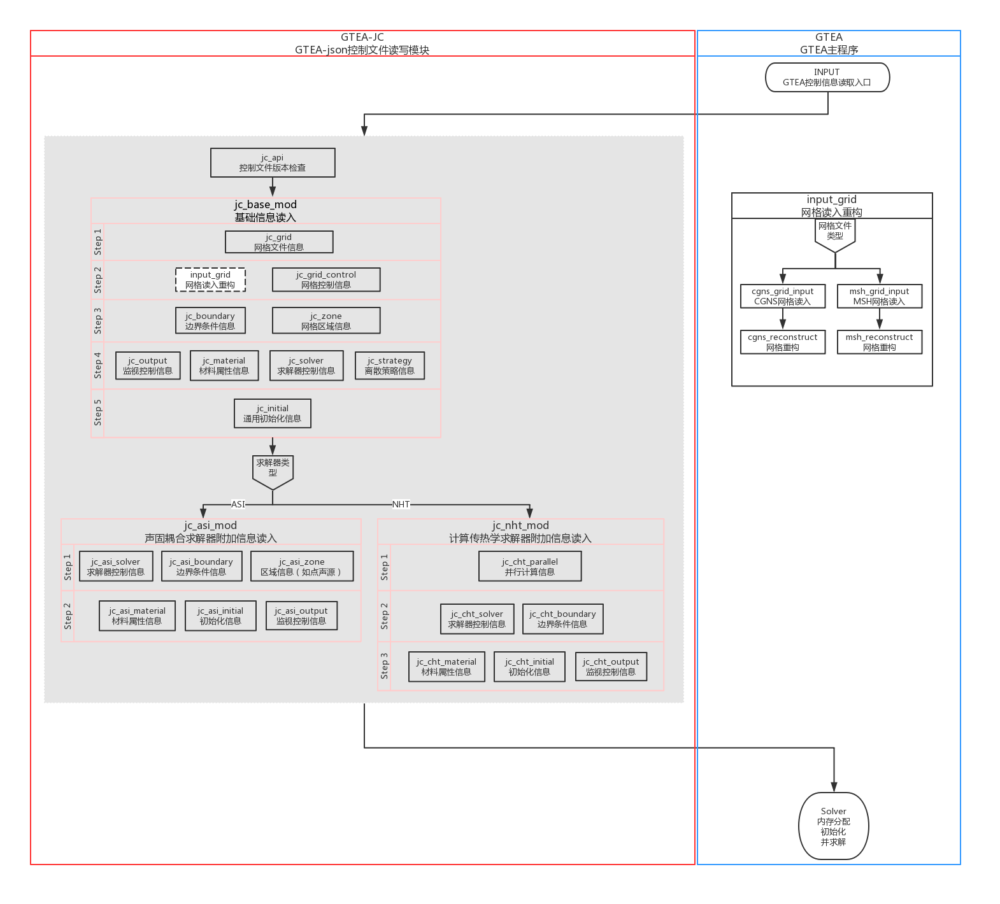
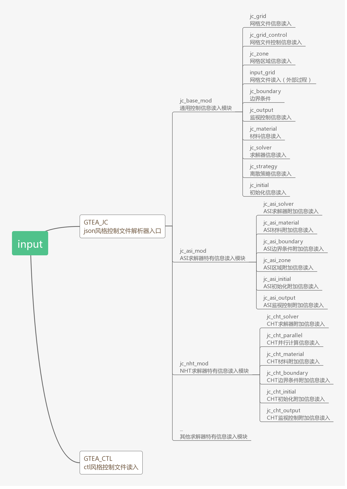

# APP_json-fortran
application of json-fortran

## Build

Make a soft link before building the code:
```
cd src
ln -s ../assets/json-fortran/src ./json-fortran
```

Two ways are provided to build the APP_json-fortran with JSON-fortran library (libjsonfortran).

* A [FoBiS](https://github.com/szaghi/FoBiS) configuration file (`fobos`) is provided that can build the library and application case. Use the `mode` flag to indicate what to build. For example:
  * To build the application case using gfortran: `FoBiS.py build -f fobos -mode app-gnu`
  * To build  the application case using ifort: `FoBiS.py build -f fobos -mode app-intel`
  * To build a static library using gfortran: `FoBiS.py build -f fobos -mode static-gnu`
  * To build a static library using ifort: `FoBiS.py build -f fobos -mode static-intel`

  The full set of modes are: `static-gnu`, `static-gnu-debug`, `static-intel`, `static-intel-debug`, `shared-gnu`, `shared-gnu-debug`, `shared-intel`, `shared-intel-debug`, `app-gnu`, `app-gnu-debug`, `app-intel`, `app-intel-debug`
  
* A [Visual Studio](https://www.visualstudio.com/) project is included for building the code on Windows with the Intel Fortran Compiler. The project has been tested with Visual Studio 2013 and 2017.

* CMake is complicated, I gave up it.

## Documentation

The documentation can be generated by processing the source files with [FORD](https://github.com/cmacmackin/ford): 
```
ford -d ./src --exclude_dir ./src/json_to_map_test ford_project.md
```

And the other two call graphics is also given below:




